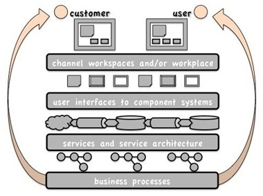
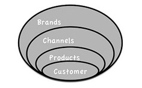
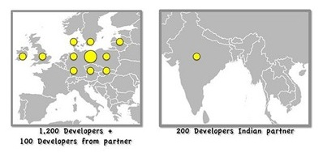

## Core banking source (case)

|Case &nbsp; &nbsp; &nbsp; &nbsp; &nbsp;|Comments &nbsp; &nbsp; &nbsp; &nbsp; &nbsp; &nbsp; &nbsp; &nbsp;|
|:--- |:--- |
| Presentation by Peter Forman executive CIO of International European Bank (IEB), to new hires at the Dublin offices of State Bank (SB). SB was purchased by IEB and recently achieved full systems integration with its new parent. Identities and names anonymised. |  | 
|"IEB is a leading player in Northern Europe; we reached this place through organic growth and well chosen acquisitions over the past ten years. What is interesting thing about us is we really don’t have an IT organisation. We have a development organisation! And my responsibility isn’t really IT, it’s product, process and systems so on.   Some things in the lower stack of IT operations have become a commodity, like IT operations, like how you handle a notebook like this, we’re not differentiating ourselves on that. However, financial services are one of the most digitalised industries of all. What we are… The services we are selling, they are digital! I know you can still have credit card, and there are some notes, still, even in Ireland there are cheques still... so, of course there is paper as well, but really all our new service products are digital, so we really compete very much based on our abilities to use IT both in our business development but also in our productivity. So IT is verymuch the heart of that. Not the IT! But the development utilising IT!    | | 
| For us IT does matter! We compete based on our abilities of using IT to bring the best products and processes to the market. Technology is our production engine and information technology development is our business heart. And 'single platform' is at the heart of our business model, a single banking platform, a single way of doing things, across all ourbanking brands and customer services. All our banking 'brands', including SB, will and do use the same platform, 'Single Platform', and the customer is at the core of this. 'Single Platform'is built on a SOA, a Service Oriented Architecture. | | 
|  I can announce today that we reached agreement on our newest acquisition, our biggest and most complex yet, Lokalny Bank Polska (LBP) and its Baltic brands. How will we achieve this,our largest integration so far? That’s why we have our offshore development and shared services centre partnership with one of India's fastest growing IT companies. They will assist some of the projects. We chose the partner that we ‘liked’, that had the same ‘model’ in mind as we had ourselves. And also of course an aspect, that we wanted a partner where we use two, three, four hundred developers but we would still be very important to them. If we needed to scale and that was really important for us but we had chosen a bigger company like Infosys or Tata, then maybe it wouldn’t be as important for Infosys or Tata.| Mirroring organisation / values is good but choosing on the assumption that a bigger company would not care as much may be a mistake. |
|  We started off in India in October last year and the plan was to steadily increase the number of employees, first ten, twenty, thirty, forty. But now the LBP opportunity develops, for this big project we have to do twenty hundred man-years of development in one year alone. We are currently twelve hundred developers across Northern Europe. They, I should say 'we' now have two hundred developers in India and a hundred or so in our Head Office, and we’ve added a lot of external contractors as well. Our partner, they’re doing the actual hiring of the people for us. And they are running Customer satisfaction call centre services as well, they actually have the Customer responsibility in some way, and actually, we treat them just like employees. They are developing using our development process, totally the same thing. Of course the training cost to bring them in, is a little bit higher, we use CMMI, that’s what they’re used to doing as well, so our development process is not different.The development model also it’s the same development model for all persons. We are running CMMI projects, and it’s very much based on CMMI and focusing on CMMI disciplines, because, you cannot run too many different systems at the same time. Our development model is now compliant to CMMI level three. Many of our projects are close to being level three. But on average it’s only a little bit on top of level 2. In the past, we’ve had always quite good people, so we’ve been able to succeed with our projects, but sometimes, actually we’ve been able to succeed with a project even though the processes were not very good. So of course there’s a lot of advantage in being better at doing the work, but I think the most important thing, is if we, with the governance process, can ensure that we actually do the right work. | | 
