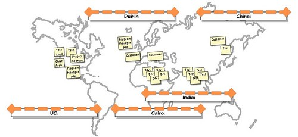

# Managing Global Local (case)
### Interview with Declan, Project Programme Manager - Dublin.

|Case | Comments|
|:--- |:---------------------------- |
| "Bringing this project up to the starting line is a story in itself however I can say we **had a  great start**. A **really compelling prototype**, demonstrated all the key functionality; web access,  cloud data, simple workflow, **fine grained ownership with security**, reporting, **detailed  versioning**, multilingual. We **demonstrated the capacity to delivery a key internal service to the  global company**. You don't really need to know too much about the detail." |   |
| "**The initial prototype was a joint production between Santa Monica (US) and Dublin**, we  pitched the project at our quarterly Knowledge Exchange event. In the company we call this  kind of bidding process **'outsourcing inside'**. We **ended up with bids from three other groups**,  from our offices in **Cairo (Egypt), Pune (India) and Langfang (China)**. Some of them signed up  as 50% 'own time', the others were full-time. Cairo provided full-time developers, Langfang  and Pune gave us full-time testers (figure 1)."      |   |
| "**We applied formal project planning from the start**. The project is **outsourced to multiple sites**  so **a number of different cultures are involved**. From our video calls I can say that the **physical  environments at all sites appear to be open plan cubicle formats**, or 'tube-farms'. It is a tribute  to the whole team that **a passion for quality and for doing the job well has remained  throughout and that is common across all geographies.**" |   |
| "The **working cultures have little differences from office to office** but I can say **that's a  strength**. The vendor development team in Cairo appear to **think little of working 24 hours a  day, 7 days a week** if they feel it necessary. Some of the flexibility shown in Cairo **has its cost.  After a 'spike' of effort they need to recover before reverting to normal working hours**,  inevitably your life outside (or lack of sleep) catches up with you. **Those of us in Dublin and  the US, we need our sleep and breaks just a little more** but we're nearly always on hand to  check mail, and, **if necessary, work at weekends too**. The test teams in India and China are  very structured, very productive, and seem to always work the same hours, sometimes little  later on busy weekdays, very rarely at weekends. In contrast, **the part-time nature of the  involvement of some of the players contributes to a certain lack of accountability**, after all this  isn't their 100% day job. You might load a work-task in Project at 50% but they **aren't really  able to allocate 50% all the time.**" | Talking about the Cairo development team Declan says *"Those of us in Dublin and the US, we need our sleep and breaks just a little more"*. I have difficulty believing that anyone would prefer to work 24/7 to the point that recovery time is needed before returning to normal work. I am concerned that the project timelines mean that this kind of effort is required, and why in Cairo? I believe the organisation has some ethical responsibility to ensure that the vendor is not exploiting staff. |
| "With the number of locations involved in conference calls we've found that **verbal  communications can be a big problem**. The **mixture of accents** in each office is compounded  by **differing audio quality** across the sites. **Audio and video quality degradation is just  unavoidable**. We're a global technology leader and **only use best-in-class systems and still it's  difficult to have perfectly clear group discussions**. I think it has been **a factor in generating  some miscommunication.**"  | The issue here is recognised, cultural differences and technology limitations accepted, but we are missing an approach to mitigate their effects. I suggest that Sensedemanding (Vlaar et al., 2008) is purposefully introduced as a necessary way for client and supplier understanding to be matched. |
| "But the situation we're dealing with now... The **formal project management** approach requires  an initial design process, **very structured, heavy on documentation and long-winded**. Crucially  we agreed on **multiple customers with different requirements**, so **every possible feature  requirement was included in the plan from the start**. You could say, with three customers the  **project might lack a certain direction**. The customers (and I suspect architects) were  **essentially free to add their own personal dreams into the requirements and specifications**.  The **requirements are also 'moving targets'** because the goals of the different customer  groups have shifted over time." | The project would be easier and possibly more successful, if features were prioritised, for instance using Moscow method to reduce the development to more manageable pieces. |
| "We followed formal project planning practice, a **one year schedule** with **three major  milestones**: alpha, beta, general release. Each feature had a feature spec written, subjected  to a review and sign-off meeting. Feature **spec review and sign-off ends up being quite  lengthy** and it has to happen for each feature. After the feature specification is nailed down  the developers create a detailed design spec. This hammers out the finer details of the  features. The **test teams use the design spec to write a test spec** and start generating 'white  box' tests. The developers take the design specs and implement them. " |   |
| "It was pretty obvious that the **formal approach takes time, but it can also lead to over  engineered feature specifications.** This **causes problems elsewhere because of integration**,  features have to work with each other, and the **interdependencies are complicated in  unexpected ways.** The **alpha milestone was the point where first draft features were  integrated. Debugging these interactions and interdependencies takes more time and  generates further instabilities.**"  | They should introduce earlier integration testing, small changes, test, feedback, change, (push left).  |
| "It quickly became clear that while the features had been **highly designed, perhaps even 'over  engineered', their integration with each other was troublesome.** While it had been considered  during design it was obvious that each feature's **designer should have studied the interfaces  with the others far more closely.** Another factor was that the customers had, in some cases,  quite **different requirements; the outputs of features customised for one customer regularly  caused problems as inputs for features customised for another.** **Debugging the interactions**  between the features has **pushed the schedule out by months.**" | Frustratingly clear that the project aims are too complex for this approach, short-term small iterations will simplify and allow early detection of failures. |
| "We've been on a **'death march' to reach the beta milestone. Management** are beginning to  **question the project's funding.** We have a management meeting next week, the **project is  close to being canned**, but a lot of blood, sweat and tears has been invested. I think **everyone  wants to give it a chance.**"  |   |
| "Starting with a concept, prototyping, and making the funding pitch is the base of a good  technology recipe. How to succeed with distributed development teams? That's the secret  sauce." | Assumption is that distributed teams is the main issue;   but the major issue I see, and mentioned during the interview,    is related to the wide scope and changing nature of customer, and possibly architect, specifications.   I would suggest breaking this project into smaller parts,   introduce newer Agile practices with sprints, iterative changes and releases within much smaller timelines. |

## Thoughts 

# Reading

## Links
